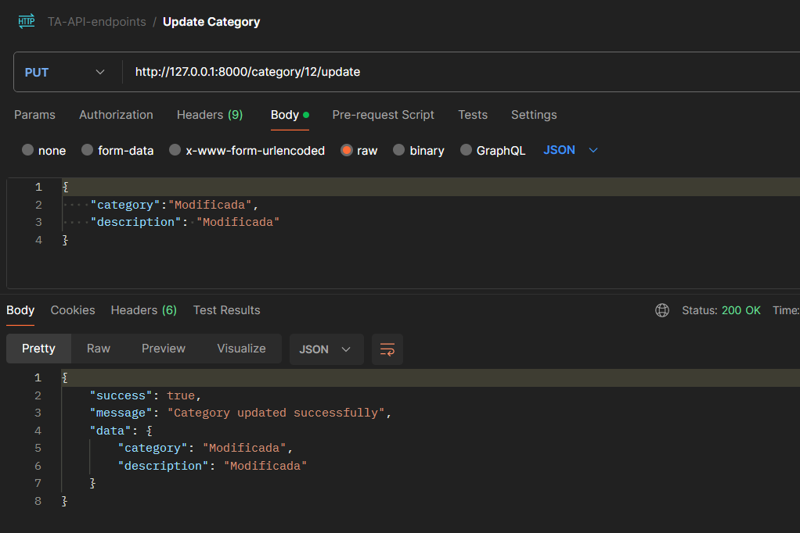

 
 <br>

 # <div align="center"> 💥Quasar Dynamics Technical Assessment 💥</div>
### <div align="center"> 💥API Notes Symfont💥</div>

 
<div align="center">
    
</div>
 
<br>
 

# Welcome   
Developed as part of the Quasar Dynamics Technical Assessment.


<div style="text-align: center;">
    
</div>
 
 

## Project content 

<ol>
  <a href="#"></a></li>
  <li><a href="#local-installation">Local Installation</a></li> 
  <li><a href="#stack">Stack</a></li>
  <li><a href="#diagrama-db">Diagram Database</a></li> 
  <li><a href="#endpoints">Endpoints</a></li>
  <li><a href="#contributions">Contributions</a></li>
  <li><a href="#repository-branches">Repository Branches</a></li>
  <li><a href="#license">License</a></li>  
  <li><a href="#issues-and-solutions">Issues and Solutions</a></li>
  <li><a href="#contact">Contact</a></li>
  <li><a href="#images">Imagenes</a></li>
 

</ol>

## Local Installation
 
1. Clone the repository.

2. Install the dependencies required for the project. 

    - ` $ composer install`
3. Create the database:    
    - ` $ php bin/console doctrine:database:create`
4.  Run the migrations:
    - `$ php bin/console doctrine:migrations:migrate `
5. $ Run the fixtures: 
    - `$ php bin/console doctrine:fixtures:load`
6. Start the server: 
    - `$ symfony server:start ` 
 

 
## Stack
<div align="center"> 
 


  
  
  
 </div>

## Diagrama DB 

In the diagram, we can observe that each user can have many notes with a OneToMany relationship, but a note can only belong to one user, making the inverse ManytoOne.

Notes have a ManyToMany relationship with Category since a note can have many categories and a Category can belong to many notes, thus corresponding to a respective intermediate table called Category-Note with a ManyToOne inverse relationship.

<div style="text-align: center;">
    
</div>
 

## Endpoints 
 
<div><a href="https://www.postman.com/telecoms-meteorologist-95304418/workspace/api-notes/collection/30593296-9a0053be-6e0c-40e3-b360-6058c8b2c5d9?action=share&creator=30593296 ">POSTMAN</a></div>
<div><a href="https://www.postman.com/telecoms-meteorologist-95304418/workspace/api-notes/collection/30593296-9a0053be-6e0c-40e3-b360-6058c8b2c5d9?action=share&creator=30593296 ">https://www.postman.com/telecoms-meteorologist-95304418/workspace/api-notes/collection/30593296-9a0053be-6e0c-40e3-b360-6058c8b2c5d9?action=share&creator=30593296 </a></div>
 
  
## Contributions
Suggestions and contributions are always welcome. 

You can do this in two ways:

1. Opening an issue.
2. Fork the repository
    - Create a new branch.  
        ```
        $ git checkout -b feature/username-improvement
        ```
    - Commit your changes.
        ```
        $ git commit -m 'feat: improve X thing'
        ```
    - Push the branch.
        ```
        $ git push origin feature/username-improvement
        ```
    - Open a Pull Request.

## Repository Branches

🍃 This project has been developed in the following branches:

1.- **Master**: Considered as the main branch, where the project has been initiated and finalized for deployment purposes.

2.- **Dev**: This branch is where the project has been developed.
 

## License

This project is under the MIT License. Please refer to the LICENSE file for more information.

## Issues and Solutions

### Issue 1: Authentication Configuration

-**Description:** Difficulties were encountered during the initial authentication setup.

-**Solution:** Successfully resolved by reviewing the official documentation and ensuring each step was followed correctly.

### Issue 2: Conflicts Incorporating JWT into the Project

-**Description:**  Errors were encountered when trying to incorporate JWT into the project due to incompatibilities of some dependencies with Symfony 7.

-**Solution:**   I have not yet found a solution to this problem, possibly Dockerizing the application might help avoid this issue.
 
## Author

- **Vincenzo Donnarumma Veitia**

## Contact   
<a href = "mailto:vincenzodonnarumma22@gmail.com"  target="_blank">

</a>
<a href="https://github.com/vincenzo2202"  target="_blank">
    
</a>  
<a href="https://www.linkedin.com/in/vincenzo2202/" target="_blank">

</a> 
<br>
<br>
<a href="https://www.vincenzodonnarumma.com" target="_blank"> www.vincenzodonnarumma.com </a> 
 

## Images

<br>
<div style="text-align: center;">
    
</div>
<br>
<div style="text-align: center;">
    
</div>
<br>
<div style="text-align: center;">
    
</div>
<br>
<div style="text-align: center;">
    
</div>
 
 